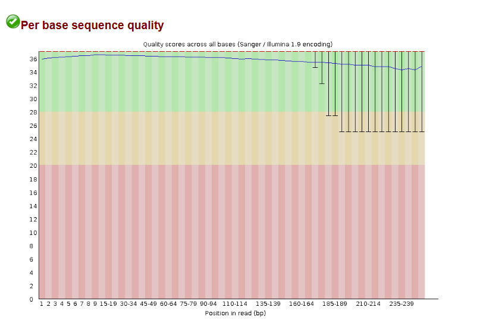
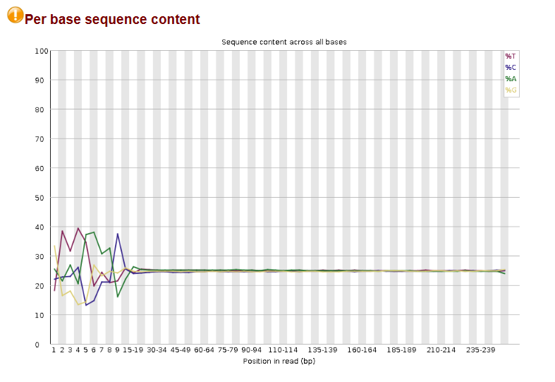
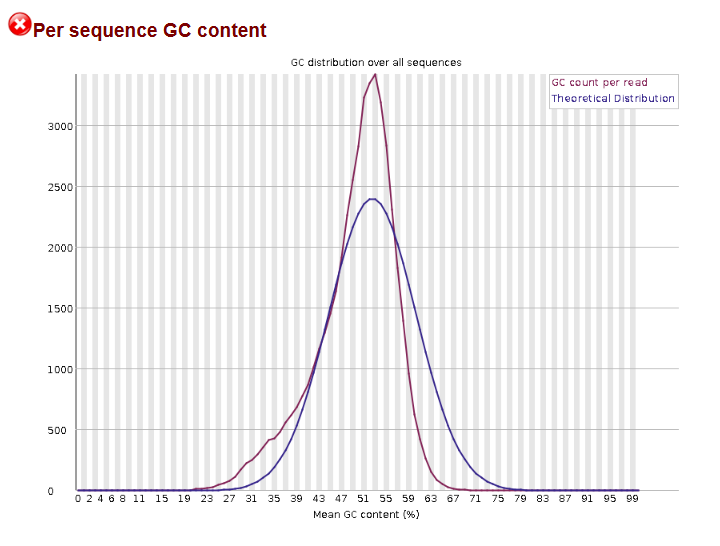

# NGS Quality Control Workflow

A reproducible NGS preprocessing workflow developed in Galaxy for paired-end sequencing data. The workflow performs quality-based read trimming with Trimmomatic followed by quality assessment using FastQC.

## Project Overview

The workflow processes paired-end sequencing data from three sequencing runs:

- SRR25629153
- SRR25629154
- SRR25629155

The pipeline consists of the following steps:

1. Input paired-end FASTQ dataset collection
2. Quality-based read trimming using Trimmomatic
3. Quality control of trimmed reads using FastQC

## Workflow

The workflow was created and executed in Galaxy.

The complete Galaxy workflow definition is available in:

`Pre-processing.ga`

This file can be imported into Galaxy to reproduce the workflow.

## Trimmomatic Parameters

Paired-end reads were processed using Trimmomatic with the following quality filtering parameters:

| Operation | Parameter |
|---|---|
| LEADING | 20 |
| TRAILING | 20 |
| SLIDINGWINDOW | 5:20 |
| MINLEN | 50 |

These settings remove low-quality bases from the beginning and end of reads, perform sliding-window quality trimming, and discard reads shorter than 50 bp after trimming.

## FastQC Quality Assessment

FastQC was used to evaluate the quality of the trimmed sequencing reads.

### Per-base Sequence Quality

The reads show high base quality across most positions, with the median quality scores remaining in the high-quality range.

### Per-base Sequence Content

Variation in nucleotide composition is visible at the beginning of the reads, followed by stabilization of base composition across later positions.

### GC Content Distribution

The observed GC distribution differs from the theoretical distribution, which was flagged by FastQC and may reflect characteristics of the analyzed sequencing data.

## Tools

- Galaxy
- Trimmomatic
- FastQC

## Repository Structure

- `Pre-processing.ga` – exported Galaxy workflow
- `images/` – workflow overview and selected FastQC results
- `README.md` – project documentation

## Skills Demonstrated

NGS data preprocessing, paired-end sequencing data handling, quality-based read trimming, FastQC report interpretation, Galaxy workflow development, and reproducible bioinformatics analysis.
